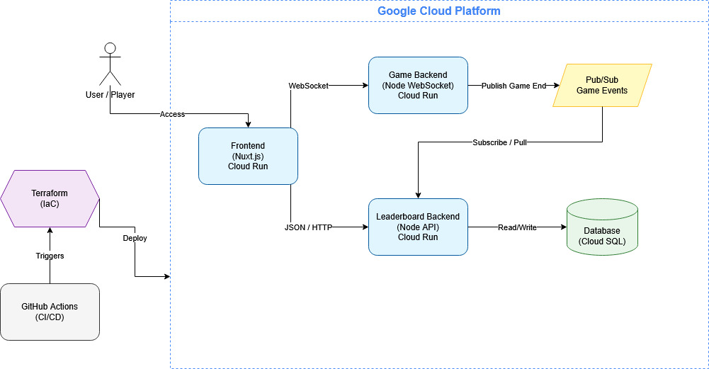

# Minesweeper Cloud

Minesweeper Cloud is a web-based multiplayer Minesweeper game project deployed on Google Cloud Platform. The application is split into three small services: a Nuxt frontend, a WebSocket game backend, and a leaderboard backend. The services communicate through explicit APIs
and use Google Pub/Sub plus Cloud SQL to store won game results.

The main idea is simple: the game should feel real-time while people are playing, but leaderboard storage should be handled separately so the game server is not responsible for database work.

## Architecture



The frontend is the only service used directly by the player. It opens a WebSocket connection to the game backend for live gameplay and calls the leaderboard backend over HTTP when it needs leaderboard data.
When a ranked game is completed, the game backend publishes a result event to Pub/Sub. The leaderboard backend consumes that event and writes the result into Cloud SQL.

## Main Components

### Frontend

The frontend is a Nuxt application. It renders the Minesweeper board, handles player input, manages game setup, and displays leaderboard entries.
The board rendering uses PixiJS, which is suitable here because the project supports very large boards such as `100x100` and `300x300`.

Important frontend responsibilities:

- create or join a game
- keep a WebSocket session with the game backend
- send reveal, flag, and cursor actions
- render board updates received from the backend
- fetch leaderboard pages from the leaderboard API

Runtime configuration:

- `NUXT_PUBLIC_WS_URL` points to the game backend WebSocket endpoint
- `NUXT_PUBLIC_LEADERBOARD_URL` points to the leaderboard HTTP endpoint

### Game Backend

The game backend is a Node.js service using WebSockets. It owns the active game sessions and the Minesweeper rules. This includes board creation, bomb placement, tile reveal logic, flagging, player cursor updates, game state, and win/loss detection.

The game backend does not write directly to the database. When a ranked game ends successfully, it publishes a game result to Pub/Sub. This keeps live gameplay separate from slower persistence work.

Important details:

- default port: `8085`
- protocol: binary WebSocket messages
- shared contract package: `@saper/contracts`
- local game IDs are limited to one byte, with `255` reserved as `NEW_GAME_ID`
- parked games are cleaned up after a configurable TTL

### Shared Contracts

The frontend and game backend use the same generated protocol contract.

This contract defines messages such as:

- `CreateGameRequest`
- `JoinGameRequest`
- `RevealTileRequest`
- `FlagTileRequest`
- `ConnectResponse`
- `RevealTilesResponse`
- `GameOverResponse`
- error and cursor update messages

Using a shared contract matters because the WebSocket messages are binary. Both sides need to agree exactly on field names, enum values, and message structure.

### Leaderboard Backend

The leaderboard backend is a Node.js HTTP API with two jobs:

1. consume completed game events from Pub/Sub
2. serve leaderboard data to the frontend

It validates incoming Pub/Sub messages before inserting them into PostgreSQL. Only ranked level combinations are stored. Custom board sizes or custom difficulties are not added to the ranked leaderboard.

Main HTTP endpoints:
- `GET /levels` returns supported ranked level codes
- `GET /leaderboard?level=<code>&limit=10&page=1` returns a paginated leaderboard

Leaderboard entries are sorted by fastest completion time. If two results have the same time, the older completion date and then the row ID are used as tie breakers.

### Database

The deployed database is Cloud SQL for PostgreSQL. Locally, Docker Compose runs PostgreSQL with the same logical database name and user.

The main table is `leaderboard_entries`. It stores:

- game ID
- level code
- player names
- completion time in milliseconds
- completion timestamp
- creation timestamp

The leaderboard backend creates the table and index during startup if they do not already exist.

### Pub/Sub

Pub/Sub decouples the game backend from the leaderboard backend.

This is useful because a finished game should not depend directly on a database write. The game backend publishes a compact event, and the leaderboard backend is responsible for validating and storing it.
If the leaderboard service temporarily has a problem, Pub/Sub can retry message delivery.

The default topic and subscription names are:

- topic: `game-results`
- subscription: `leaderboard-game-results`

## Game Flow

1. The player opens the Nuxt frontend.
2. The player creates a new game or joins an existing game.
3. The frontend opens a WebSocket connection to the game backend.
4. The game backend creates or retrieves the game session and sends the initial board metadata.
5. Player actions are sent over WebSocket as binary contract messages.
6. The backend updates the game state and sends tile or game-state updates back to connected clients.
7. If a ranked game is won, the game backend publishes a result event to Pub/Sub.
8. The leaderboard backend receives the event, validates it, and writes it to PostgreSQL.
9. The frontend reads leaderboard data from the leaderboard HTTP API.

## Ranked Levels

Ranked leaderboard levels are encoded using a board-size letter and a difficulty letter.

Board size codes:

- `S` small
- `M` medium
- `B` big
- `H` huge

Difficulty codes:

- `E` easy
- `I` intermediate
- `H` hard
- `X` expert

For example, `SE` means small board with easy difficulty, while `BX` means big board with expert difficulty. Custom games are playable but are not ranked.

## Local Development

The whole system can be started locally with Docker Compose:

```bash
docker compose up --build
```

Local service URLs:

- frontend: `http://localhost:3000`
- game backend: `ws://localhost:8085`
- leaderboard backend: `http://localhost:8090`
- PostgreSQL: `localhost:5432`
- Pub/Sub emulator: `localhost:8086`

The local setup uses:

- PostgreSQL container for leaderboard storage
- Google Pub/Sub emulator for game result events
- one container for each application service

## Deployment

Deployment is handled by GitHub Actions and Terraform.

On pushes to `main`, the workflow in `.github/workflows/deploy.yml` builds three Docker images:

- `game-backend`
- `frontend`
- `leaderboard-backend`

The images are pushed to Google Artifact Registry using immutable image digests. After the build job finishes, Terraform applies the infrastructure from the `terraform` directory.

Terraform creates and configures:

- Cloud Run service for the frontend
- Cloud Run service for the game backend
- Cloud Run service for the leaderboard backend
- Pub/Sub topic and subscription
- Cloud SQL PostgreSQL instance, database, and user
- IAM permissions required for Pub/Sub, Cloud SQL, and public Cloud Run access

Cloud Run is used because each service is containerized and can be deployed independently. 
The current Terraform configuration limits each service to one instance, which keeps the project simple and avoids multiplayer session state being split across multiple game backend instances.
